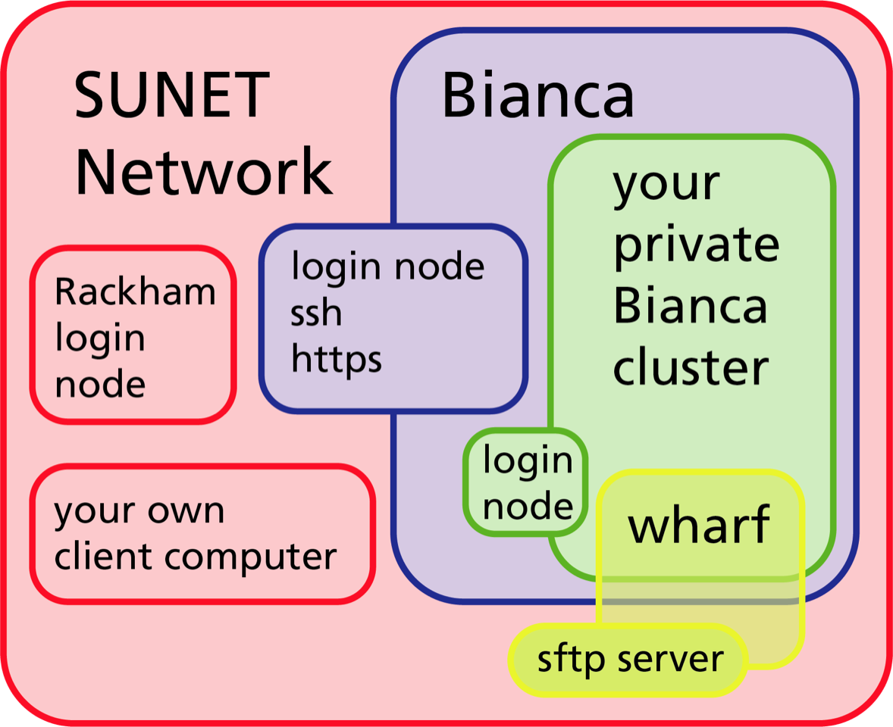

# SNIC SENS and Bianca

## Sensitive personal data

    When in doubt, contact your university's data protection officerLinks to an external site..
    Bianca is a great platform for computationally intensive research on sensitive personal data. It can also be useful for:
        national and international collaboration on sensitive personal data (without a high compute need)
        other types of sensitive data
    Bianca is not good for:
        storing data
        publishing data (unless the dataset is very popular among Bianca users, e.g. SwegenLinks to an external site., SIMPLERLinks to an external site.)

## Bianca's design

    Bianca was designed
        to make accidental data leaks difficult
        to make correct data management as easy as possible
        to emulate the HPC cluster environment that SNIC users were familiar with
        to provide a maximum amount of resources
        and to satisfy regulations.

 

 

    Bianca is only accessible from within Sunet (i.e. from university networks).
    The whole Bianca cluster (blue) contains hundreds of virtual project clusters (green), each of which is isolated from each other and the Internet.
    Data can be transferred to or from a virtual project cluster through the Wharf, which is a special file area that is visible from the Internet.

 

    When you log in to bianca.uppmax.uu.seLinks to an external site., your SSH or ThinLinc client first meets the blue Bianca login node.
    After checking your two-factor authentication, this server looks for your virtual project cluster.
    If it's present, then you are transferred to a login prompt on your cluster's login node. If not, then the virtual cluster is started.
    Inside each virtual project cluster, by default there is just a one-core login node. When you need more memory or more CPU power, you submit a job (interactive or batch), and an idle node will be moved into your project cluster.

 
## Bianca has no Internet
.. but we have “solutions”

Data transfers:

    NGI Deliver through SUPR
    Transit server (transit.uppmax.uu.se)

Software

    Modules library (almost same as Rackham)
    Local Conda repository
    Local Perl modules
    Local R packages

 

    More info at
        https://www.uppmax.uu.se/support/user-guides/bianca-user-guide/Links to an external site.

## ThinLinc

    Bianca offers graphical login
    On web:
        https://bianca.uppmax.uu.seLinks to an external site.
        requires 2-factor authentication

 

 
