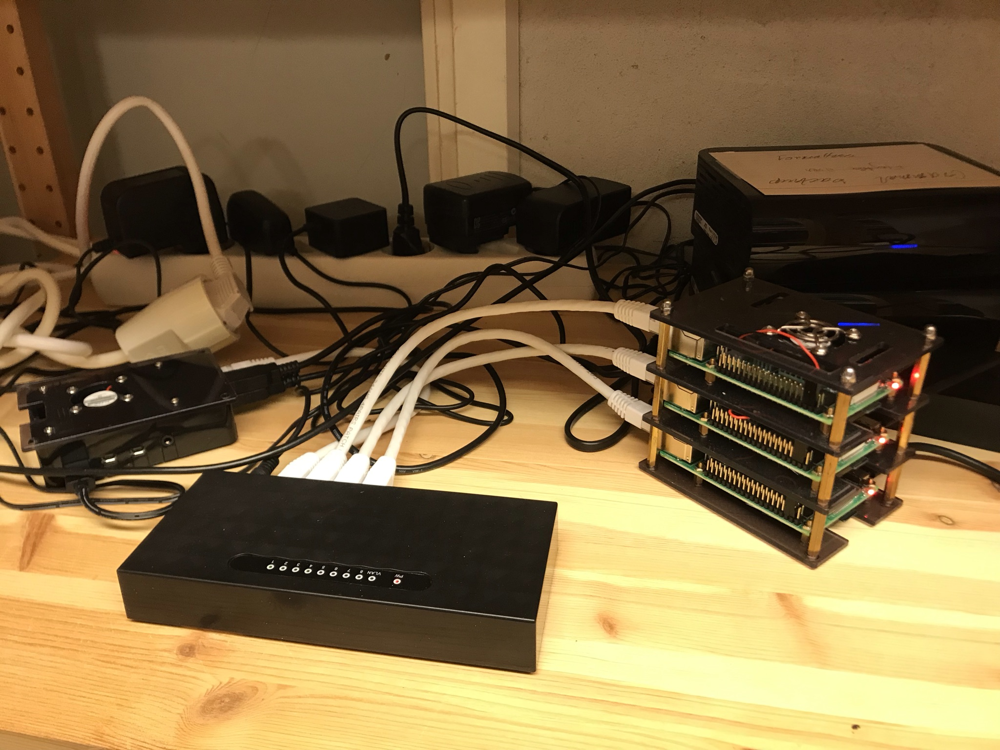

# High Performance Computing — HPC
- A recap
## What is a cluster?
- A network of computers, each computer working as a node.

- From small scale RaspberryPi cluster
     

- To supercomputers like Rackham.

- Each node contains several processor cores and RAM and a local disk called scratch.

- The user logs in to login nodes via Internet through ssh or Thinlinc.

  - Here the file management and lighter data analysis can be performed.

- The calculation nodes has to be used for intense computing. 
  - "Normal" softwares use one core.
  - Parallelized software can utilize several cores or even several nodes. Keywords signalizing this are e.g.:
    - "multi-threaded", "MPI", "distributed memory", "openMP", "shared memory".
  - To let your software run on the calculation nodes
    - start an "interactive session" or
    - "submit a batch job".
    - More about this in today's introduction to jobs.

## Storage basics
- All nodes can access:
  - Your home directory on Domus or Castor
  - Your project directories on Crex or Castor
  - Its own local scratch disk (2-3 TB)

- If you’re reading/writing a file once, use a directory on Crex or Castor
  - If you’re reading/writing a file many times...
    - Copy the file to ”scratch”, the node local disk:
        cp myFile $SNIC_TMP
        
        
 ## The UPPMAX hardware   
 
- More about the systems can be found at the [System resources page](https://www.uppmax.uu.se/resources/systems/)

 
### A little bit more about Snowy

- [User guide](https://www.uppmax.uu.se/support/user-guides/snowy-user-guide/).
  - There is a [local compute round](https://supr.snic.se/round/uppmaxcompute2021/) for UU users applying for Snowy in SUPR.
  - GU (courses) applications (including GU GPU usage) are not done in SUPR, but are supposed to be routed through the service desk. The details can be found at the [Getting started page](https://www.uppmax.uu.se/support/getting-started/course-projects/).
