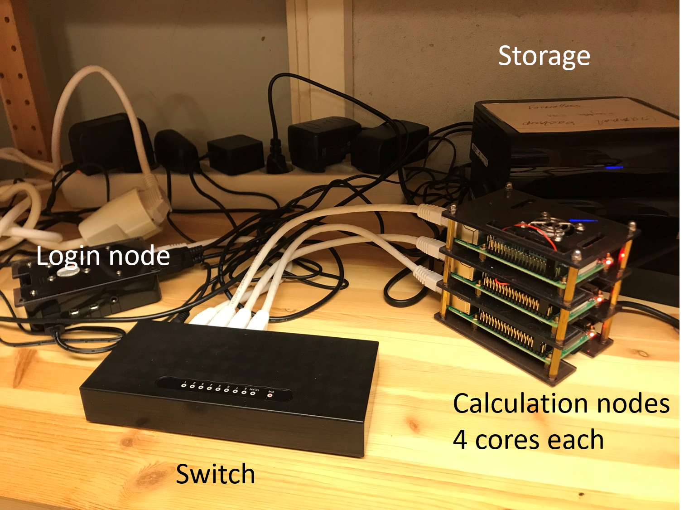

# High Performance Computing — HPC

```{objectives}
- Let's recap and go a little further into the UPPMAX hardware!
```

## What is a cluster?
- A network of computers, each computer working as a node.

- From small scale RaspberryPi cluster... 
     


- To supercomputers like Rackham.


- Each node contains several processor cores and RAM and a local disk called scratch.


- The user logs in to login nodes via Internet through ssh or Thinlinc.

  - Here the file management and lighter data analysis can be performed.




- The calculation nodes has to be used for intense computing. 
  - "Normal" softwares use one core.
  - Parallelized software can utilize several cores or even several nodes. Keywords signalizing this are e.g.:
    - "multi-threaded", "MPI", "distributed memory", "openMP", "shared memory".
  - To let your software run on the calculation nodes
    - start an "interactive session" or
    - "submit a batch job".
    - More about this in today's introduction to jobs.

## Storage basics
- All nodes can access:
  - Your home directory on Domus or Castor
  - Your project directories on Crex or Castor
  - Its own local scratch disk (2-3 TB)

- If you’re reading/writing a file once, use a directory on Crex or Castor
- If you’re reading/writing a file many times...
    - Copy the file to ”scratch”, the node local disk:
    ```
    cp myFile $SNIC_TMP
    ```
        
        
## The UPPMAX hardware   
 
### Clusters

- We have a number of compute clusters:

  -  [Rackham](https://www.uppmax.uu.se/resources/systems/the-rackham-cluster/)
, reserved for SNIC projects
  -  [Snowy](https://www.uppmax.uu.se/resources/systems/the-snowy-cluster/), GPU, long jobs reserved for UPPMAX projects and Education
  -  [Bianca](https://www.uppmax.uu.se/resources/systems/the-bianca-cluster/)
, a part of SNIC-SENS
  -  [Miarka](https://www.uppmax.uu.se/resources/systems/miarka-cluster/), reserved for Scilifelab production
  -  [UPPMAX cloud](https://www.uppmax.uu.se/resources/systems/the-uppmax-cloud/), a part of SNIC Science Cloud

- [User guides](https://www.uppmax.uu.se/support/user-guides/)

- The storage systems we have provide a total volume of about 25 PB, the equivalent of  50,000 years of 128-bit encoded music. Read more on the [storage systems page](https://www.uppmax.uu.se/resources/systems/storage-systems/).

### UPPMAX storage system names (projects & home directories)
- Rackham storage: Crex & Domus
- Bianca storage: Castor & Cygnus
- NGI production system (Miarka): Vulpes
- NGI delivery server: Grus
- Off-load storage: Lutra

### System usage
[System usage](https://www.uppmax.uu.se/resources/system-usage/)

- More about the systems can be found at the [System resources page](https://www.uppmax.uu.se/resources/systems/)

 
### A little bit more about Snowy

- [User guide](https://www.uppmax.uu.se/support/user-guides/snowy-user-guide/).
  - There is a [local compute round](https://supr.snic.se/round/uppmaxcompute2021/) for UU users applying for Snowy in SUPR.
  - GU (courses) applications (including GU GPU usage) are not done in SUPR, but are supposed to be routed through the service desk.   
  - The details can be found at the [Getting started page](https://www.uppmax.uu.se/support/getting-started/course-projects/).

### About Bianca?
- Wait for it!

## Summary about the three "common" UPPMAX clusters

| |Rackham|Snowy|Bianca|
|-------|-----|------|---|
|**Purpose**|General-purpose|General-purpose|Sensitive|
|**#  Nodes (Intel)**|486+144|228+ <br>50 Nvidia T4 GPUs|204+ <br>4 nodes á 2 <br>NVIDIA A100 GPUs|
|**Cores per node**|20/16|16|16|
|**Memory/node**|128 GB|128 GB|128 GB
|**Fat nodes**|256 GB & 1 TB| 256, 512 GB & 4 TB| 256 & 512 GB|
|**Local disk (scratch)**|2/3 TB| 4 TB| 4 TB |
|**Login nodes**|Yes| No (reached from Rackham)|Yes|
|**"Home" storage**|Domus|Domus|Castor|
|**Storage**|Crex, Lutra|Crex, Lutra|Castor|

## HPC, HTC and MTC

The Buzz word is HPC or High Performance Computing, but this is rather narrow focusing on fast calculation, i.e. processors and parallelism
Many of your projetcs are more focusing on hight throughput, large memory demands and many tasks.
Here is a list of the three most common **Computing paradigms**:

- HPC: High Performance Computing — 
- HTC: high-throughput computing — 
- MTC: Many-task computing —


```{keypoints}
- UPPMAX has several clusters 
     - each having its focus and limitation or possibilites
     - access is determined ny type of project
```
