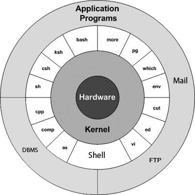

# Linux
## What is Linux?


- Daily speaking: The Linux Operating system is a UNIX like and UNIX compatible Operating system.
- Linux is a Kernel on which many different programs can run.
- The shell (bash, sh, ksh, csh, tcsh and many more) is one such program
    


 

- Actually, for it to be an OS, it is supplied with GNU software and other additions giving us the name GNU/Linux.

 


 

- Linux has a multiuser platform at its base which means permissions and security comes easy.

 
### Linux comes in different distributions, dialects or, say, flavours.
- Uppmax runs CentOS

 


 
## Using the command line

### Command line with bash (Bourne Again Shell)
- A Unix shell and command language.
- Often default shell


- The command-line interface: the bash prompt $
- bash can be seen as a program that finds and runs other programs
- bash is scripting language that is referred to as a shell
  - (because it sits around the kernel making it easy to interact with)

 

 
### The prompt

[info]$ <span style="color:blue">program</span> word1 word2 word3 […]

- [info] is configurable, and usually tells you who you are, on what system, and where in the file system.
  
  - Example: 

    ```bash=
      [bjornc@rackham3 linux_tutorial]$
    ```

  - For changing info (only for advanced users!)  Does not matter for this course!:
    - https://www.cyberciti.biz/tips/howto-linux-unix-bash-shell-setup-prompt.html (Links to an external site.)
  - The <span style="color:blue">program</span> to run is the first word
  - All words are separated by spaces


 
### Example bash command

<section>
    
```{image} ./img/mv_inbox.png
:alt: mv inbox
:width: 300px
:align: left
``` 

<br/><br/>

```{image} ./img/program_flags.png
:alt: program flags
:width: 300px
:align: left
```
    
<br/><br/><br/><br/><br/><br/><br/><br/><br/><br/><br/><br/><br/><br/><br/><br/><br/><br/>
   

</section>

 

- Terminal screen shows
    
</p>

               

 
### Tab Completion
<section>

```{image} ./img/tab.png
:alt: tab
:width: 200px
:align: left
```

<br/><br/><br/><br/><br/>
</section>

- Whenever you’re writing a path or filename on the bash prompt, you can strike the ‘tab’ key to
ask Bash to complete what you’re writing.

- Get in the habit of this — it will save you many hours!

 
## Editing files with file/text editors


### gedit 
- graphical user interface — GUI, needs X-server

- Also graphical editor within MobaXterm

### nano 
- keyboard shortcuts shown on-screen)
- Cheatsheet: [http://staffwww.fullcoll.edu/sedwards/nano/UsefulNanoKeyCommands.html](http://staffwww.fullcoll.edu/sedwards/nano/UsefulNanoKeyCommands.html
  - ^ = Ctrl, M = meta key)
    - (Windows M = Alt)
    - (On Mac: in the Terminal.app go to Preferences -> Settings -> Keyboard and turn on "Use option as meta key": then M = Alt

### vim 
- fast and powerful, once you learn it
- on UPPMAX started with command "vi"

  - 1. Insert mode (type like normal text editor. Press 'i' for insert mode)
  - 2. Command mode (give commands to the editor to get things done . Press ESC for command mode)
  - Cheatsheet: [https://coderwall.com/p/adv71w/basic-vim-commands-for-getting-started](https://coderwall.com/p/adv71w/basic-vim-commands-for-getting-started)
 
### gvim 
- vim with a GUI, lots of features very Fast

### emacs 
- fast and powerful, once you learn it
  - Cheatsheet: [https://www.gnu.org/software/emacs/refcards/pdf/refcard.pdf](https://www.gnu.org/software/emacs/refcards/pdf/refcard.pdf)
    - (C = Ctrl)
- also With GUI
   - $ emacs –nw
     - keeps you in terminal window.

## The graphical editors
- When starting the graphical versions of an editor, add "&" to be able to use the command line while program is open.
  - Ex: $ gedit &
  - If not, you can Ctrl+z and type "bg" to send program to background.

```{discussion} Try out later!
   **Try them out and pick one favorite editor!**
```

## Typical sources of error


```{Warning}
- Capitalization matters in file names and program names
- Spaces matter.
  - Always have a space after the program name.
  - Don’t add spaces within file names.
- Check that you are in the right place in the file system.
- File permissions. Check that the right read,write and execute permission are set.
```


 
## Caution!!


```{Warning}

- There is no undo for:
  - copy (cp),
  - move (mv), and
  - remove (rm).
- **Beware of overwriting files and deleting the wrong ones.**
```
 
```{Note}
- **Tip: make "rm" ask if you really want to erase:**
  - Within a session: Type in the command prompt

        alias rm=‘rm -i’

  - Override asking with 

        rm –f <>

  - Edit file ".bashrc" in /home directory by adding the alias line for this to start everytime.
- This will also work for mv and cp!
```

```{Note}
- If you do destroy your data, email UPPMAX support, we may be able to help.
```

```{challenge} gh-pages-2: Host your own github page
- Deploy own website reusing a template:
  - Follow the steps from GitHub Pages <https://pages.github.com/>.
    The documentation there is very good so there is no need for us to duplicate the screenshots
  - Select "Project site"
  - Select "Choose a theme" (for instance "Minimal")
  - Click "Select theme"
  - Adjust the README.md and commit
  - Browse your page on `http://username.github.io/repository` (adjust "username" and "repository")
- Make a change to the repository after the webpage has been deployed for the first time
- Please wait few minutes and then verify that the change shows up on the website
```


```{callout} Real-life examples
- Research Software Hour (built using [Zola](https://www.getzola.org/))
  - [Source](https://raw.githubusercontent.com/ResearchSoftwareHour/researchsoftwarehour.github.io/main/content/about.md)
  - Result: <https://researchsoftwarehour.github.io/about/>
- This lesson (built using [Sphinx](https://www.sphinx-doc.org/)
    and [MyST](https://myst-parser.readthedocs.io/)
    and [sphinx-lesson](https://coderefinery.github.io/sphinx-lesson/))
  - [Source](https://raw.githubusercontent.com/coderefinery/documentation/main/content/gh-pages.md)
  - Result: this page
```

