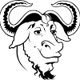
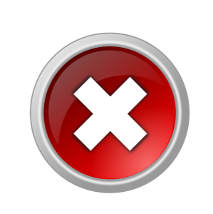
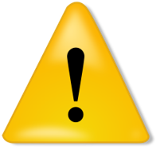

# Linux
## What is Linux?


- Daily speaking: The Linux Operating system is a UNIX like and UNIX compatible Operating system.
- Linux is a Kernel on which many different programs can run.
- The shell (bash, sh, ksh, csh, tcsh and many more) is one such program
    


 

- Actually, for it to be an OS, it is supplied with GNU software and other additions giving us the name GNU/Linux.

 



 

- Linux has a multiuser platform at its base which means permissions and security comes easy.

 
### Linux comes in different distributions, dialects or, say, flavours.
- Uppmax runs CentOS

 


 
## Using the command line

### Command line with bash (Bourne Again Shell)
- A Unix shell and command language.
- Often default shell


- The command-line interface: the bash prompt $
- bash can be seen as a program that finds and runs other programs
- bash is scripting language that is referred to as a shell
  - (because it sits around the kernel making it easy to interact with)

 

 
### The prompt

[info]$ <span style="color:blue">program</span> word1 word2 word3 […]

- [info] is configurable, and usually tells you who you are, on what system, and where in the file system.
  
  - Example: 

    ```bash=
      [bjornc@rackham3 linux_tutorial]$
    ```

  - For changing info (only for advanced users!)  Does not matter for this course!:
    - https://www.cyberciti.biz/tips/howto-linux-unix-bash-shell-setup-prompt.html (Links to an external site.)
  - The <span style="color:blue">program</span> to run is the first word
  - All words are separated by spaces

 
### Program, flags, and files

- Input to the program:
  - Flags: specific single letters or words that change the behaviour of a program.
  - Arguments: text given to the program when started, e.g. file names.
  - Terminal input: text given to the program while it runs.

- Output from the program:
  - Most Linux programs output to the terminal.
  - Some programs also write to files.


 
### Example bash command


- Terminal screen shows

               

 
### Tab Completion


 
- Whenever you’re writing a path or filename on the bash prompt, you can strike the ‘tab’ key to
ask Bash to complete what you’re writing.

- Get in the habit of this — it will save you many hours!

 
## Editing files


### File/text editors

- gedit (graphical user interface — GUI, needs X-server)

- Also graphical editor within MobaXterm

- nano (keyboard shortcuts shown on-screen)
  - Cheatsheet: http://staffwww.fullcoll.edu/sedwards/nano/UsefulNanoKeyCommands.html (Links to an external site.)
    - (^ = Ctrl, M = meta key)
       - (Windows M = Alt)
       - (On Mac: in the Terminal.app go to Preferences -> Settings -> Keyboard and turn on "Use option as meta key": then M = Alt

- vim (fast and powerful, once you learn it)
  - on UPPMAX started with command "vi"

  - 1. Insert mode (type like normal text editor. Press i for insert mode)

  - 2. Command mode (give commands to the editor to get things done . Press ESC for command mode)
  - Cheatsheet: https://coderwall.com/p/adv71w/basic-vim-commands-for-getting-started (Links to an external site.)
 
- gvim vim with a GUI, lots of features very Fast

- emacs (fast and powerful, once you learn it)
  - Cheatsheet: https://www.gnu.org/software/emacs/refcards/pdf/refcard.pdf (Links to an external site.)
    - (C = Ctrl)
   - also With GUI
   - $ emacs –nw
     - keeps you in terminal window.

- When starting the graphical versions, add "&" to be able to use the command line while program is open.
  - $ gedit &
  - If not, you can Ctrl+z and type bg to send program to background.

- **Try them out and pick one favorite editor!**


## Typical sources of error



- Capitalization matters in file names and program names

- Spaces matter.
  - Always have a space after the program name.
  - Don’t add spaces within file names.
- Check that you are in the right place in the file system.
- File permissions. Check that the right read,write and execute permission are set.

 
### Caution!!



- Some words of warning:
  - There is no undo for
    - copy (cp),
    - move (mv), and
    - remove (rm).
  - **Beware of overwriting files and deleting the wrong ones.**

 

- **Tip: make "rm" ask if you really want to erase:**
  - Within a session: Type in the command prompt

        alias rm=‘rm -i’

  - Override asking with 

        rm –f <>

  - Edit file ".bashrc" in /home directory by adding the alias line for this to start everytime.
- This will also work for mv and cp!

 

- If you do destroy your data, email UPPMAX support, we may be able to help.

