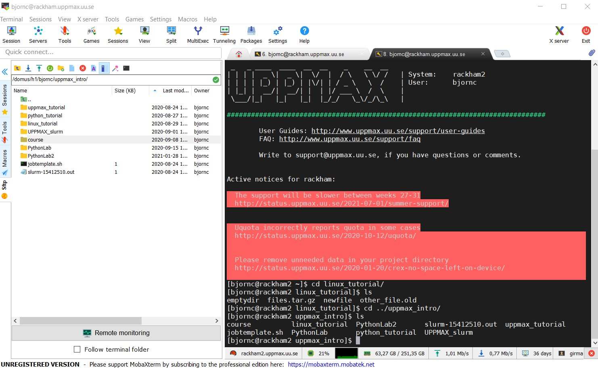

# Login

```{questions}
- How to reach UPPMAX clusters?
- Can one use graphics?
- Where do I arrive when I log in?

```

```{objectives}
- We'll relate our login session to the specific "area" in the cluster.
- We'll go through platform specific (Mac/Linux/Windows) ways to log in to UPPMAX.
- Try yourself!
```

```{note}
If you lack a user account, visit the [Getting started page](https://www.uppmax.uu.se/support/getting-started/course-projects/)
```

## The login

```{admonition} Login procedure
  **Which login procedure is best for You, depends on:**
  - Your background
  - your OS environment,
  - the interaction with your local computer
```

- When logging in to UPPMAX from your local computer you will arrive to your home folder at the login node.
- This means that only light analysis and and calculations should be made here.
- You will see this in the prompt after "@" as the clustername and a low number. For instance:
   ```bash=
      [<user>@rackham3 linux_tutorial]$
    ```
- You willl ater learn how to reach the calculation nodes. Then the prompt states the node number with a single letter, like "r" for Rackham. For instance:
   ```bash=
      [<user>@r484 linux_tutorial]
   ```


## MAC and LINUX users

### Terminal

- Download XQuartz or other X11 server for Mac OS
  - [https://www.xquartz.org/](https://www.xquartz.org/)
  - This is to enable graphics.

- Start built-in Terminal.

```bash=
$ ssh -Y <username>@rackham.uppmax.uu.se
```
- "< >" prompts you to set the keyword specific for you or your needs. In the example above, this is basically your username.


### Graphical file manager

- For copying of files with sftp (secure file transfer protocol) between your client computer (where you are) and the cluster **Filezilla** can be the choice.
- [https://filezilla-project.org/download.php?type=client](https://filezilla-project.org/download.php?type=client)
 


```{callout} Problems with installations?
The built-in terminal without X11 is sufficient first days of the course!
```

## Windows users

### Most straight-forward
- Install a ssh (secure shell) program with built-in X11 and sftp file manager
  - [MobaXterm](https://mobaxterm.mobatek.net/)
    - sftp frame makes it easy to move, upload and download files.
  - See section below.

- If problem with the above installation, the putty.exe terminal is sufficient first days of the course!

    - No graphics.

    - [https://www.putty.org/](https://www.putty.org/)


<!---
### A bit more complicated (and not necessary)

- Download and install ONE of the X-servers below (to enable graphics)
  - GWSL https://sourceforge.net/projects/vcxsrv/ (Links to an external site.)
  - X-ming https://opticos.github.io/gwsl (Links to an external site.)z
  - VcXsrv https://sourceforge.net/projects/xming/ (Links to an external site.)

- not necessary:
  - Install WSL (Windows Subsystem for Linux) 
    - https://docs.microsoft.com/en-us/windows/wsl/install-win10 (Links to an external site.)
    - Don’t forget to update to wsl2
- Install a distribution or a ssh (secure shell) program
  - Distribution such as ubuntu or
  - (recommended) a ssh program such as MobaXTerm
  - https://mobaxterm.mobatek.net/ (Links to an external site.)
    - sftp frame makes it easy to move, upload and download files.

- You may want to check this webpage as well!
  - https://hackmd.io/@pmitev/Linux4WinUsers (Links to an external site.)
--->
 
### MobaXterm



- Start local terminal and a SSH session by:

```bash=
$ ssh -Y <username>@rackham.uppmax.uu.se
```


- Or even better, create and save a SSH session, as shown in image below.
  - This allows you to use MobaXterm as a file manager and  to use the built-in graphical texteditor.
  - You can rename the session in the Bookmark settings tab.


### Graphical file manager (Windows)

- For copying of files between your client computer (where you are) and the cluster WinSCP can also be the choice.
  - [https://winscp.net/eng/download.php](https://winscp.net/eng/download.php) 

```{callout} Problems with installations?
The built-in terminal without X11 is sufficient first days of the course!
```

 
## X11-forwarding from the command line (generally)

- Graphics can be sent through the SSH connection you’re using to connect
  - Use primarily `ssh -Y <...>` or secondary `ssh -X <...>`

- The X servers that enables graphics are needed, as mentioned above!
  - When starting a graphical program, a new window will open, but your terminal will be “locked”.
  - Run using "`&`" at the end to run it as a background process e.g. "`xeyes &`" or “`gedit &`”


- Alternatively, use `<ctrl>-z` to put e.g. gedit to sleep and type "`bg`" to make last process in background.

``````{challenge} Login to **Rackham**, using your terminal
- First try:
```bash=
$ ssh -Y <username>@rackham.uppmax.uu.se
```
- If you receive errors or warnings, instead try:
```bash=
$ ssh <username>@rackham.uppmax.uu.se
```
- If you do have X11 installed:
```bash=
$ xeyes &
```
``````
 
## ThinLinc (all platforms!)

- Both Rackham and Bianca offer graphical login.
- This gives you a desktop environment, as if you were working on your own computer!
- On web:
  - [https://rackham-gui.uppmax.uu.se](https://rackham-gui.uppmax.uu.se)
  - [https://bianca.uppmax.uu.se](https://bianca.uppmax.uu.se)
    - requires [2-factor authentication](https://www.uppmax.uu.se/support/user-guides/setting-up-two-factor-authentication/)


 - Or use the client (only for Rackham)
  - [https://www.cendio.com/thinlinc/download](https://www.cendio.com/thinlinc/download)

```{challenge} Try Thinlinc from web
  - Try the web version now if you don't already have the software installed!
  ```

 ```{keypoints}
- You reach UPPMAX clusters either using a terminal or Thinlinc
- Graphics are included in Thinlinc and from terminal if you have enabled X11
- When you log in from your local computer you will always arrive at a login node with limited resources. 
  - You reach the calculations nodes from within the login node (See  Submitting jobs section)
```
